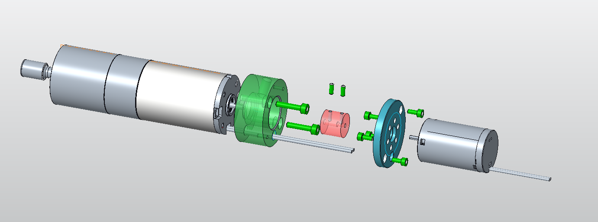

# DC-Tachometer
- Led the design and production of a custom drive using a DC motor as a tachometer
- Rapidly iterated on initial design to quickly create functional samples for customer validation
- Employed GD+T best practices to optimize production and reduce scrap rate

